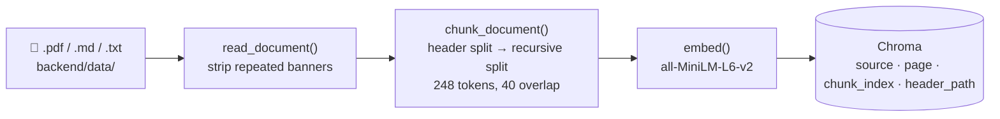
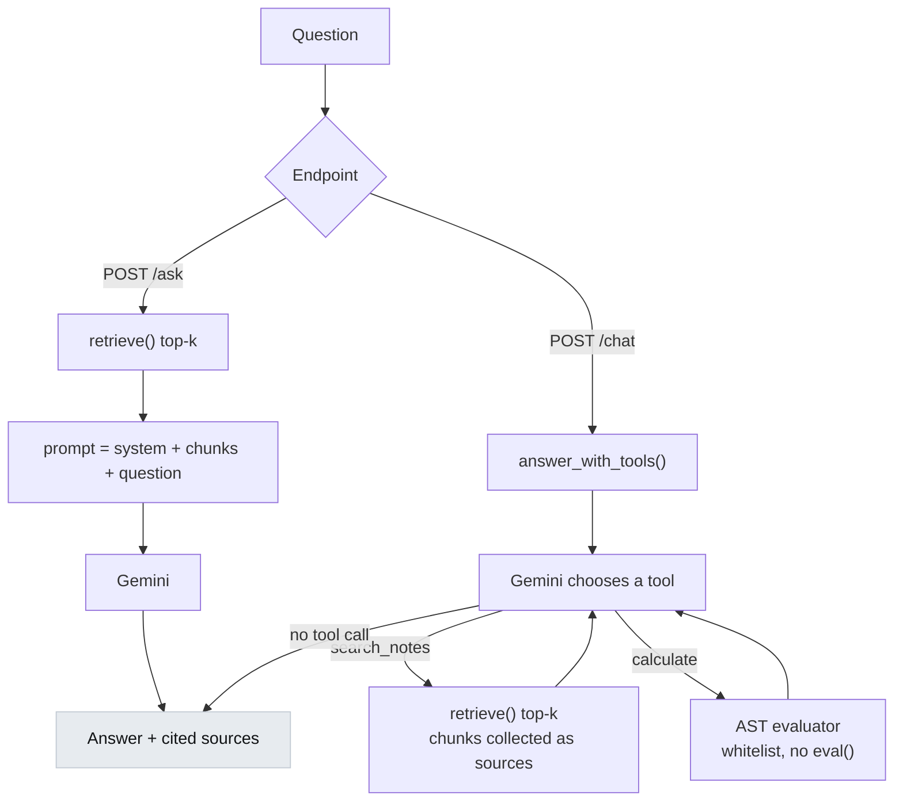

# Ask My Notes

RAG over your own notes: PDF/Markdown/text → structure-aware chunks → local
embeddings → Chroma → Gemini, with citations back to the source page.



## Setup

```bash
python3 -m venv .venv
source .venv/bin/activate
pip install -r requirements.txt

cp .env.example .env   # then add your GEMINI_API_KEY
```

## Use

```bash
# 1. Drop notes into backend/data/ (.pdf, .md, .markdown, .txt), then index
python -m backend.embed_and_store

# 2. Ask from the CLI
python -m backend.agent "what is the critical section problem?"

# ...or let the model pick its own tools (notes search + calculator)
python -m backend.agent --tools "what must a solution guarantee?"

# 3. Or run the API
uvicorn backend.main:app --reload
```

```bash
curl -X POST localhost:8000/chat \
  -H 'content-type: application/json' \
  -d '{"query": "what is bounded waiting?"}'
```

| Endpoint | Method | Purpose |
| --- | --- | --- |
| `/health` | GET | Status plus what is indexed |
| `/ask` | POST | `{question, top_k}` → retrieve-then-answer, 1 request |
| `/chat` | POST | `{query, top_k}` → agentic loop, 2-3 requests |
| `/ingest` | POST | Re-index `backend/data/` (`?reset=true` to wipe first) |

Interactive docs at `localhost:8000/docs`.

## Layout

```
backend/
  main.py            FastAPI endpoints, CORS, upstream error mapping
  ingest.py          PDF/MD/TXT → boilerplate strip → structure-aware chunks
  embed_and_store.py chunks → embeddings → Chroma (+ metadata)
  retrieval.py       embedding model, collection, similarity search
  agent.py           prompts, tools, Gemini calls, agentic loop
  data/              your notes (gitignored)
  chroma/            persisted vector store (gitignored)
eval.py              retrieval accuracy harness (10 hardcoded cases)
frontend/            Vite + React + TypeScript chat UI
  src/api.ts         typed client for POST /chat
  src/App.tsx        input box, message history, source citations, theme toggle
  src/App.css        light/dark palettes
```

## How it works

**Chunking** is two-stage. Notes with markdown headers are split on them first,
so no chunk crosses a header boundary and each carries its header path
(`Databases > Indexing`); headerless notes skip that step. Each section is then
split recursively, sized in the embedding model's own tokens.

Repeated headers and footers (slide-deck banners, running titles) are detected
and stripped at read time — on a lecture deck they can be ~20% of all text, and
because they are identical everywhere they flatten retrieval ranking.

**Chunk size** is `CHUNK_TOKENS = 300` with 40 token overlap, automatically
capped at what the embedding model will actually read. `all-MiniLM-L6-v2` stops
at 256 tokens, so the effective size is 248 and ingest prints a note saying so.
Swap `EMBED_MODEL` for one with a longer window and the full 300 applies.

**Retrieval** embeds the query with the same model used at index time and
returns the top-k nearest chunks with `source`, `page`, `chunk_index`, and
`header_path`.

**Answering** has two paths. `/ask` always retrieves and answers in one
request; `/chat` hands the model two tools and loops until it stops calling
them, at two to three requests per question (capped at `MAX_TOOL_TURNS = 6`).



**Scope.** The agent answers only from what `search_notes` returns and declines
anything the notes do not cover, naming what they are about instead. What makes
a question in scope is whether the notes cover it, never its subject — if your
notes are about world leaders, it answers questions about world leaders. Pure
calculations are the one exception and are always allowed.

**The calculator** parses expressions with `ast` and evaluates a whitelist —
never `eval`. 24 functions (`sqrt`, `log`, `factorial`, `comb`, `gcd`, `hypot`,
trigonometry, …), the constants `pi`/`e`/`tau`, and guards against expression
bombs (`9**9**9`, `factorial(100000)`).

## Docker

Requires Docker (`brew install --cask docker`, then launch Docker.app once).

```bash
docker compose up --build      # frontend :3000, backend :8000
```

Note `docker compose` (subcommand), not the retired `docker-compose` binary.

Reads `GEMINI_API_KEY` from `.env`. The Chroma index lives in a named volume
(`chroma-data`) so it survives restarts; `./backend/data` is bind-mounted, so
notes dropped there are visible without a rebuild. Index them with:

```bash
docker compose exec backend python -m backend.embed_and_store
```

`VITE_API_BASE` is baked into the frontend bundle at build time and must be the
URL the *browser* can reach (`http://localhost:8000`), not the container name.

## Retrieval eval

```bash
python eval.py --fixtures    # index a demo corpus, then evaluate
python eval.py --k 3         # tighter cutoff
python eval.py --verbose     # show every hit and its distance
```

10 hardcoded questions, each with the document that should answer it. Exercises
retrieval only — no LLM call, so it costs nothing and needs no API key. Reports
pass/fail, accuracy, and the rank the correct document landed at. Exits non-zero
on any failure, so it can gate CI. Edit `CASES` to point at your own notes.

## Frontend

```bash
cd frontend
npm install
npm run dev      # http://localhost:5173
```

Expects the API at `http://localhost:8000`; override with `VITE_API_BASE` in
`frontend/.env`. Port 5173 is already in the backend's CORS allowlist.

Answers render as markdown (headings, bold, lists, tables) and LaTeX renders as
maths via KaTeX. A `$` before a digit is treated as currency, not a maths
delimiter, so `$47 per month and $12 per million` stays literal. Sources appear
as clickable chips that expand to the excerpt they came from. The theme toggle
follows your OS by default and remembers an explicit choice in `localStorage`.

## Configuration

All optional except the key; set in `.env`.

| Variable | Default | Purpose |
| --- | --- | --- |
| `GEMINI_API_KEY` | — | Required. From aistudio.google.com/apikey |
| `GEMINI_MODEL` | `gemini-3.7-flash` | Any Gemini model id |
| `EMBED_MODEL` | `all-MiniLM-L6-v2` | Any sentence-transformers model |
| `TOP_K` | `5` | Chunks retrieved per question |
| `CHROMA_COLLECTION` | `notes` | Collection name |
| `DATA_DIR` / `CHROMA_DIR` | `backend/data`, `backend/chroma` | Paths |
| `CORS_ORIGINS` | localhost dev ports | Comma-separated origins |

## Notes and limitations

- **No conversation history.** Every question is independent — the frontend
  keeps messages in React state only, and the backend sends no prior turns.
  Follow-ups like "what about the second one?" will not resolve. Refreshing the
  page clears the transcript.
- **Free-tier quota is 20 requests/day per model.** The agentic loop spends 2-3
  per question, so roughly 7 questions/day. `gemini-3.5-flash-lite` draws on a
  separate pool if the flagship is exhausted or returning 503s.
- Embeddings run locally on CPU; the first ingest downloads the model (~90 MB).
- Re-indexing a file replaces its chunks, so it is safe to repeat.
- Scanned PDFs with no text layer yield nothing — they need OCR first.
- Markdown notes cite as `notes.md - Section > Subsection`; PDFs cite with a
  page number.
- `python eval.py --fixtures` replaces the collection with its demo corpus;
  re-run `python -m backend.embed_and_store` afterwards.
- `.env` is read once at import. Restart uvicorn after changing it — `--reload`
  watches `.py` files only.
- Upstream failures map to real status codes: 503 for a transient outage, 429
  for a rate limit (with `Retry-After` when retrying will help), 502 for a
  misconfiguration. Never a bare 500.
